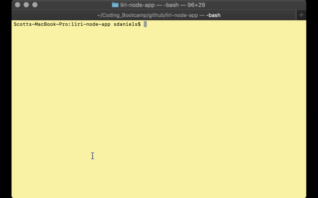
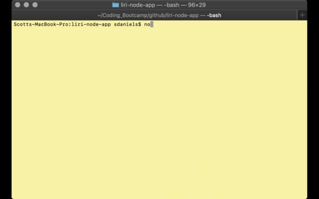

# liri-node-app
## _Language Interpretation and Recognition Interface - Boot Camp Assignment 8 - Node.js_


The purpose of the LIRI bot is to search for songs via Spotifiy, upcoming concerts via Bands in Town, or movie details from the Open Movie Data Base (OMDB).   

The app makes use of the following node.js packages:
 * axios - used to make API calls to Bands in Town and OMDB.
 * moment - used to display dates in a specific format.
 * node-spotify-api - a great library that makes interacting with the Spotify API trivial. 
 * dotenv - used to access environmental variables, which is what we use to store the API keys that allow th application to function.
 
My version of this program makes use of several functions.  There are four functions in particular that do the bulk of the work.
 * bandsInTownEvents - This function is responsible for interacting with the Bands in Town API, it takes the user's input and retrieves upcoming concert dates.
 * spotifySong - This function takes advantage of the node-spotify-api library to make the API calls to spotify.  If no search is defined, we default to "The Sign" by Ace of Bass.
 * movieThis - This function is responsible for retrieving the entered movie data from the Open Movie Database API.
 * doWhatItSays - This function takes a text file, line by line, and executes the api calls defined.  It uses the following format: command,parameter.  
 
 Valid commands for both the CLI and the text file are:
   * spotify-this-song
   * movie-this
   * concert-this
   * do-what-it-says

Example of text file:
```
spotify-this-song,"Wild Eyes"
movie-this,Saving Private Ryan
concert-this,August Burns Red
```

  There are two additional functions that work in tandem with the others:

 * logThis - This function just takes what is output to the console, via console.log, and also writes it to a log file.

 * specialCharsBandsInTown - This function works in tandem with _bandsInTownEvents_, and is actually run before the _bandsInTownEvents_ function fires.  It is responsible for converting any special characters to a URL encoded format expected by the API.

Each function is fired based on the command sent.  

### __Instructions__

### _Prerequisites_

In order to use this application you'll need to have the following dependencies installed:
* git - [Link](https://git-scm.com/)
* node - [Link](https://nodejs.org/en/)

You'll also need to get your own API keys for the following:
* Spotify
* Bands in Town
* OMDB

#### Installation

Once the above dependencies are installed.

To use this application, you'll need to first clone the repo.

Firstly, you'll want to open your terminal, and navigate to either your home directory, or one of your choosing.  When you are ready to begin installation, perform the following:

```
git clone https://github.com/sdaniels6363/liri-node-app.git
```

Once cloned, navigate to the directory that it was cloned into.

```
# For the sake of instructions we'll assume you have cloned to your home directory.

cd ~/liri-node-app/
```

Your next step will be to perform the dependency installation of the necessary javascript libraries.

From your terminal, issue the following commands

```
npm install
```

Next, you'll need to create your .env file, this file should go in the same directory that you have cloned the repo to.  This is the file that will be used to store your API keys that are required for the application to function.

```
touch .env
```

Then add the following to the .env file.

```
OMDB_KEY=<your-key-here>
SPOTIFY_ID=<your-spotify-id-here>
SPOTIFY_SECRET=<your-spotify-secret-here>
BANDS_ID=<your-key-here>
```

Once you have added the keys, you should be ready to go.  

## Examples

Here are some examples of how to use the commands.

command - 'concert-this'
```
node liri.js concert-this August Burns Red
```


command - 'spotify-this-song'
```
node liri.js spotify-this-song Wild Eyes
```


command - 'movie-this'
```
node liri.js movie-this Saving Private Ryan
```


command - 'do-what-it-says'
```
node liri.js do-what-it-says filename.txt
```

